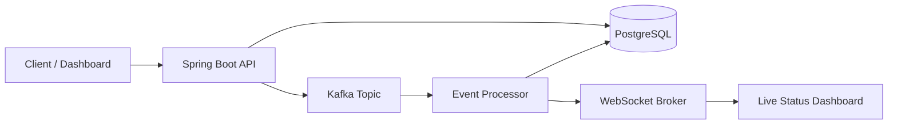

# Enterprise Event Processing Platform

A professional Java backend portfolio project that demonstrates real-time event ingestion, asynchronous processing, audit tracking, retry handling, and live WebSocket updates.

This project is designed to look like an enterprise backend system used in payment, reconciliation, banking, trading, logistics, or order-processing platforms.

## Why This Project Stands Out

Most portfolio projects are simple CRUD apps. This project demonstrates skills interviewers care about:

- Java 21 and Spring Boot 3
- REST API design
- Spring Security with JWT
- Kafka-based asynchronous processing
- PostgreSQL persistence
- Event audit history
- Retry and dead-letter handling
- WebSocket/STOMP live updates
- Redis-ready architecture
- Docker Compose local infrastructure
- GitHub Actions CI
- Swagger/OpenAPI documentation
- Unit and integration testing foundation

## Architecture



## Core Features

### Authentication
- Login endpoint returns JWT token.
- Protected APIs require `Authorization: Bearer <token>`.

Demo credentials:

```text
username: admin
password: admin123
```

### Event Ingestion
Submit business events such as payments, reconciliation records, order updates, or transaction messages.

Status flow:

```text
RECEIVED -> PROCESSING -> SUCCESS / FAILED -> RETRYING -> DEAD_LETTER
```

### Async Processing
Events are published to Kafka and processed by a separate consumer component.

### Retry Handling
Failed events can be retried manually through the API.

### Audit History
Every status transition is stored in an audit table.

### Real-Time Updates
The processor publishes event status updates through WebSocket/STOMP on:

```text
/topic/events
```

## Tech Stack

| Area | Technology |
|---|---|
| Language | Java 21 |
| Framework | Spring Boot 3 |
| Security | Spring Security + JWT |
| Database | PostgreSQL |
| Messaging | Kafka |
| Cache | Redis |
| Real-time | WebSocket/STOMP |
| API Docs | Swagger/OpenAPI |
| Build | Maven |
| DevOps | Docker, Docker Compose, GitHub Actions |
| Testing | JUnit 5, Mockito, Testcontainers |

## Run Locally

### 1. Start infrastructure

```bash
docker compose up -d
```

### 2. Run the application

```bash
mvn spring-boot:run
```

### 3. Open Swagger

```text
http://localhost:8080/swagger-ui/index.html
```

### 4. Check health

```text
http://localhost:8080/actuator/health
```

## API Quick Start

### Login

```bash
curl -X POST http://localhost:8080/api/auth/login \
  -H "Content-Type: application/json" \
  -d '{"username":"admin","password":"admin123"}'
```

### Create Event

```bash
curl -X POST http://localhost:8080/api/events \
  -H "Authorization: Bearer <token>" \
  -H "Content-Type: application/json" \
  -d '{"correlationId":"TXN-1001","eventType":"PAYMENT","payload":"{\"amount\":250}"}'
```

### Get Failed Events

```bash
curl -X GET "http://localhost:8080/api/events?status=FAILED" \
  -H "Authorization: Bearer <token>"
```

### Retry Event

```bash
curl -X POST http://localhost:8080/api/events/<event-id>/retry \
  -H "Authorization: Bearer <token>"
```

## Suggested Resume Bullet

> Built an enterprise event processing platform using Java 21, Spring Boot, Kafka, PostgreSQL, Redis, WebSocket, and Docker to process transaction events asynchronously with audit tracking, retry handling, dead-letter management, JWT security, and real-time status updates.

## Suggested Interview Explanation

This project simulates a real enterprise backend platform where incoming business events are accepted through REST APIs, stored in PostgreSQL, published to Kafka, processed asynchronously, audited at every state transition, and pushed to users in real time using WebSocket/STOMP. It demonstrates backend design, distributed systems basics, operational recovery, and production-style engineering practices.

## Future Improvements

- Add React dashboard
- Add role-based access control
- Add Prometheus and Grafana dashboards
- Add DLQ Kafka topic
- Add Flyway database migrations
- Add full Testcontainers integration tests
- Add Kubernetes deployment manifests
