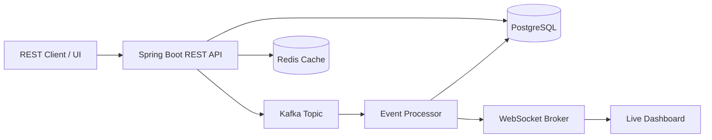

# Architecture

## Design Highlights

- REST API accepts event ingestion requests.
- Kafka decouples ingestion from processing.
- PostgreSQL stores event records and audit history.
- WebSocket/STOMP broadcasts live event status changes.
- Retry API supports operational recovery.
- Dead-letter status captures events that fail repeatedly.
