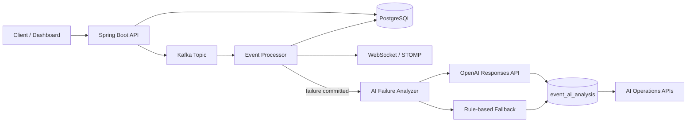

# Enterprise Event Processing Platform — AI Edition

A Java 21 / Spring Boot portfolio platform demonstrating event ingestion, Kafka processing, PostgreSQL persistence, audit history, manual recovery, WebSocket/STOMP updates, JWT security, and **AI-assisted production operations**.

## What changed

The project now includes an AI operations layer that activates when an event reaches `FAILED` or `DEAD_LETTER`.

It produces and persists:

- probable root cause
- error category
- retry recommendation
- remediation guidance
- confidence score
- model/source metadata

The AI is intentionally **human-in-the-loop**. It can recommend a retry but never executes one automatically.

## Architecture



## Main stack

Java 21, Spring Boot 3.3.5, Spring Security/JWT, Spring Kafka, PostgreSQL/JPA, Redis-ready integration, WebSocket/STOMP, OpenAPI, Docker Compose, JUnit/Mockito/Testcontainers foundation, OpenAI Responses API.

## Run locally

```bash
docker compose up -d
export OPENAI_API_KEY="your-key"   # optional; fallback works without it
mvn spring-boot:run
```

Swagger: `http://localhost:8080/swagger-ui/index.html`

Health: `http://localhost:8080/actuator/health`

## Login

```bash
curl -X POST http://localhost:8080/api/auth/login \
  -H "Content-Type: application/json" \
  -d '{"username":"admin","password":"admin123"}'
```

Use the returned token as `Authorization: Bearer <token>`.

## Create a successful event

```bash
curl -X POST http://localhost:8080/api/events \
  -H "Authorization: Bearer <token>" \
  -H "Content-Type: application/json" \
  -d '{"correlationId":"TXN-1001","eventType":"PAYMENT","payload":"{\"amount\":250,\"accountId\":\"A100\"}"}'
```

## Trigger an AI-analyzed data-quality failure

```bash
curl -X POST http://localhost:8080/api/events \
  -H "Authorization: Bearer <token>" \
  -H "Content-Type: application/json" \
  -d '{"correlationId":"TXN-1002","eventType":"PAYMENT","payload":"{\"amount\":250,\"accountId\":null}"}'
```

## Trigger a retryable downstream failure

```bash
curl -X POST http://localhost:8080/api/events \
  -H "Authorization: Bearer <token>" \
  -H "Content-Type: application/json" \
  -d '{"correlationId":"TXN-1003","eventType":"FAIL_DEMO","payload":"{\"amount\":250}"}'
```

## AI endpoints

```text
POST /api/ai/events/{eventId}/analyze
GET  /api/ai/events/{eventId}/analyses
GET  /api/ai/incidents/summary?minutes=60
```

## Existing event endpoints

```text
POST /api/events
GET  /api/events
GET  /api/events?status=FAILED
GET  /api/events/{id}
GET  /api/events/{id}/audit
POST /api/events/{id}/retry
```

## Failure lifecycle

```text
RECEIVED -> PROCESSING -> SUCCESS
                      \-> FAILED -> RETRYING -> ... -> DEAD_LETTER
                           |
                           +-> asynchronous AI analysis
```

## AI safety/design decisions

See `docs/AI_ARCHITECTURE.md`. The key principle is that AI produces advisory operational metadata and never becomes the source of truth for transaction state.

## Recommended next iteration

Add RAG using runbooks and historical incident resolutions (for example PostgreSQL + pgvector), then tool-calling for read-only operations such as `getFailedEvents`, `getEventHistory`, and `getSimilarIncidents`. Keep mutation tools such as retry behind explicit human approval.

## Portfolio / FDE story

This version demonstrates not just LLM integration, but the Forward Deployed Engineer pattern of taking an operational problem—failed distributed events—and adding a safe AI workflow around the real system: diagnosis, classification, remediation, auditability, fallback behavior, and human approval.
