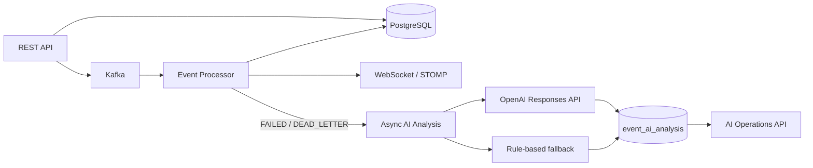

# AI Architecture

The AI layer is advisory and isolated from deterministic event processing.

## Guardrails

- AI does not modify inbound payloads.
- AI cannot execute retry automatically.
- Retry advice is stored separately from transactional event state.
- Event payload/error text are explicitly treated as untrusted data in the LLM prompt.
- `store=false` is sent to the model API.
- If AI is disabled, unavailable, or unconfigured, a deterministic classifier provides a safe fallback.
- The Kafka consumer delegates model work to a separate bounded executor so model latency does not block the consumer thread.

## Transaction boundary

Failure analysis is triggered with `@TransactionalEventListener(AFTER_COMMIT)` so the AI worker only reads committed event/error state.
